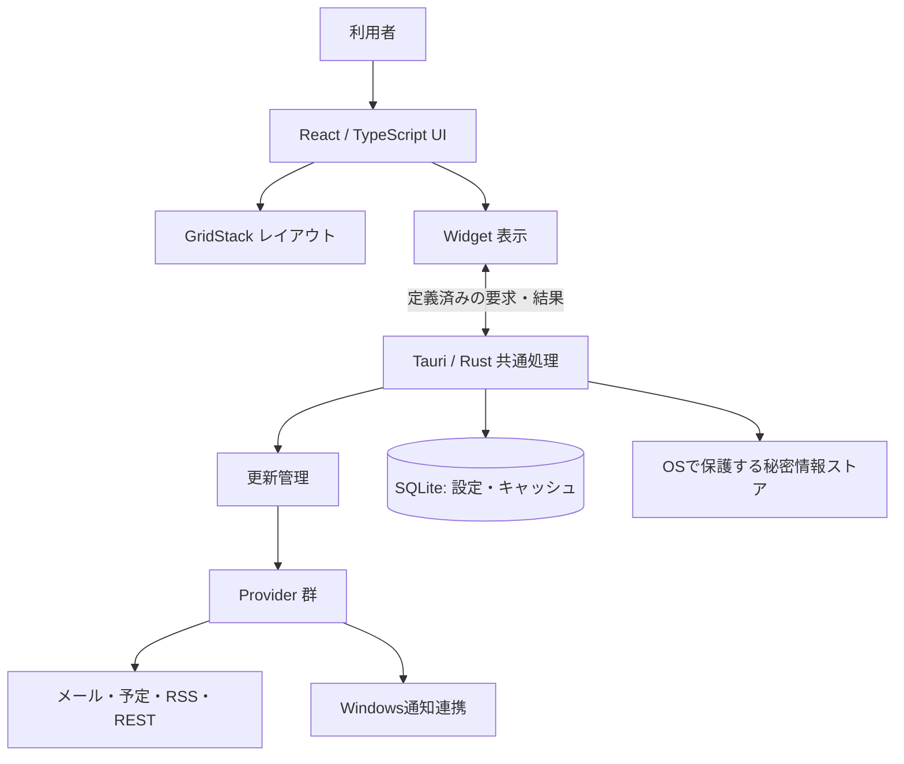

# HomeApp 仕様書草案

版: 0.1  
作成日: 2026-09-08  
状態: レビュー用草案  
製品名: HomeApp（仮称）

## 1. 目的と位置づけ

HomeApp は、予定、メール、Windows通知、ニュース、任意のAPI情報を、利用者が自由に配置したウィジェットで確認できるWindows用の「個人用情報コックピット」である。

日常的な情報確認を一画面に集約し、必要に応じて元のアプリやサービスへ移動できるようにする。表示を担当する **Widget** と、情報取得を担当する **Provider** を分離し、新しい情報源を後から追加できる構造とする。

本書は添付された構想文を仕様へ整理したものであり、実装済み機能を示すものではない。リポジトリ内には既存のアプリ実装・仕様書を確認できていない。

### 1.1 本書の読み方

| 区分 | 意味 |
| --- | --- |
| 構想由来 | 添付資料に明示された方向性・機能。詳細まで確定しているという意味ではない |
| 草案提案 | 構想を実装・評価可能にするため、本書で補った仕様。数値、初期値、運用ルールを含む |
| 要検証 | OS・サービス・配布方式などの制約を、技術検証で確認する必要がある事項 |
| 要決定 | 利用者の用途・好みによって決める事項 |

自由配置、Widget + Provider、MVPの7項目、拡張候補、技術スタック候補は構想由来とする。それ以外の詳細は、明記がない限り草案提案とする。すべての性能値・更新間隔は暫定値である。

## 2. 想定利用者・利用環境

### 2.1 想定利用者

- Windows PCで、複数のアプリやWebサービスを日常的に確認する個人。
- 情報の配置・サイズ・表示量を、自分の使い方に合わせたい利用者。
- 自作スクリプトやローカルサービスの情報を、HTTP/JSON経由で表示したい利用者。

### 2.2 初期対応環境（草案提案）

| 項目 | 初期版の扱い |
| --- | --- |
| OS | Windows 11、x64を検証対象とする。詳細な対応ビルドは配布方式決定時に確定 |
| 実行形態 | 単独デスクトップアプリ。通常ウィンドウ、最大化、任意のトレイ常駐 |
| 利用単位 | 1台のPC・1つのWindowsユーザー。HomeApp専用アカウントは不要 |
| 画面 | 2560×1440を主な設計例とし、1920×1080でも利用可能にする |
| 表示言語 | 日本語。日時の初期表示はOSの地域・タイムゾーン設定に従う |
| 保存 | レイアウト、接続設定、必要最小限のキャッシュをPC内へ保存 |
| 通信 | 外部Provider利用時に必要。オフラインでも画面・時計・保存済みレイアウトは利用可能 |

マルチモニターへのウィンドウ移動を想定する。ただし、初期版は同時に1つのダッシュボードウィンドウを表示する。

## 3. 主な利用シナリオ

1. **作業開始時の確認**: アプリを開くと、今日の予定、未読メール、Windows通知、RSSの見出しが自分の配置で表示される。
2. **自分用の画面づくり**: 編集モードでカレンダーを追加し、大きさや位置を変更して保存する。再起動後も同じ配置が復元される。
3. **必要な情報への移動**: メールやRSSの項目を選び、元サービスを既定ブラウザで開く。
4. **独自データの追加**: 自作プログラムが返すJSONをRESTウィジェットへ接続し、数値やステータスを表示する。
5. **障害時の確認**: 接続に失敗したウィジェットには最終取得時刻と原因を表示し、ほかのウィジェットは利用を続けられる。

## 4. 提供範囲と優先順位

### 4.1 P0: MVP

構想にある以下の7項目をMVPの機能範囲とする。Windows通知は要検証だが、MVPから自動的に除外しない。実現できない場合は、配布方式またはリリース範囲の変更を判断する。

| ID | 機能 | MVPで提供する内容 | 留意点 |
| --- | --- | --- | --- |
| F-01 | 自由配置・リサイズ | ウィジェットの追加、移動、サイズ変更、設定、削除、配置の保存・復元 | グリッド上での自由配置を提案 |
| F-02 | 時計 | 現在時刻、日付、曜日 | 12/24時間表示、秒表示の切替 |
| F-03 | Calendar | 選択したカレンダーの予定一覧 | 初期Providerを1種類選ぶ。閲覧中心 |
| F-04 | Mail | 未読件数と最近のメール一覧 | 初期Providerを1種類選ぶ。送信・返信は含めない |
| F-05 | Windows Notifications | アクセスを許可された、取得可能なWindows通知の一覧 | OS連携・配布条件のPoCを必須とする |
| F-06 | RSS | 登録したフィードの記事一覧 | RSS/Atomの基本項目を対象 |
| F-07 | Generic REST/JSON | HTTPで取得したJSONを汎用表示 | 最初に実装する拡張の基礎機能 |

接続管理、更新処理、エラー表示、ローカル保存、テーマ設定は、この7項目を利用するための共通基盤に含める。

### 4.2 P1: MVP後の優先拡張

| 機能 | 内容 |
| --- | --- |
| Web / iframe | 許可されているWebページの埋め込みと、外部ブラウザで開く操作 |
| Markdown | ローカルメモの作成・編集・表示 |
| 画像 | 利用者が選択した画像の表示、拡大縮小・フィット設定 |
| Launcher | 登録したURL、アプリ、ファイルを開く |
| 複数ダッシュボード | 作業用・私用などのページ切替 |
| 設定のエクスポート・インポート | 秘密情報を除いた配置・表示設定の移行 |
| 連携先の追加 | Gmail / Outlook、Google Calendar / Outlook / iCalendar等から初期版で未採用のもの |

### 4.3 P2: 将来拡張

GitHub、天気、PC状態、タスク、音楽再生、鳴潮の状態、ChatGPT / Claude使用量、各種サービス残高などをProviderとして追加する。公開Widget SDKも将来範囲とする。

これらは対応候補であり、データ取得方法や利用可能なAPIは未検証である。サービスごとに取得手段・認証・更新条件を確認して採否を決める。

### 4.4 初期版に含めないもの

- メールの送信・返信、予定の作成・変更、サービス側の既読状態の書換え。
- Windows通知の完全な履歴保管、返信、通知アクションの再実行。
- 任意のJavaScript・HTML・シェルコマンドを実行する汎用プラグイン機能。
- 複数PC間のクラウド同期、チーム共有、スマートフォン版。
- Windowsシェルの置換、デスクトップ壁紙への常時埋め込み。

## 5. 画面構成と基本操作

### 5.1 画面一覧

| 画面・領域 | 主な要素 |
| --- | --- |
| ダッシュボード | ウィジェット、編集ボタン、全体更新、設定への入口 |
| ウィジェット追加パネル | 種類一覧、概要、追加操作 |
| ウィジェット設定パネル | タイトル、接続先、表示件数、更新間隔、種類別設定 |
| 接続管理 | 接続済みアカウント・API、接続状態、接続テスト、再認証、解除 |
| アプリ設定 | テーマ、日時表示、起動・常駐設定、キャッシュ削除 |

### 5.2 初期配置例

以下は配置例であり、ウィジェットの位置や比率を固定するものではない。

```text
┌──────────────────────────────────────────────────────┐
│ HomeApp                         更新   編集   設定   │
├───────────────────┬──────────────────────────────────┤
│ 時計・日付        │ メール                           │
├───────────────────┤                                  │
│ カレンダー        ├──────────────────────────────────┤
│                   │ Windows通知                      │
├───────────────────┼──────────────────────────────────┤
│ RSS               │ REST / JSON                      │
└───────────────────┴──────────────────────────────────┘
```

初回起動時は時計と追加ガイドを表示する。未接続の外部サービスを、実データに見えるダミー情報で埋めない。

### 5.3 閲覧モード

- 位置・サイズをロックし、通常のクリックやスクロールで配置が変わらないようにする。
- ウィジェット内のリンク、手動更新、詳細表示を利用できる。
- 各ウィジェットはタイトルと状態を持つ。小さいサイズでは内容を省略しても、状態と操作への入口を残す。

### 5.4 編集モード

- 「編集」で開始し、タイトル部分のハンドルをドラッグして移動する。
- 端・角のハンドルでサイズを変更する。本文選択と移動操作を分ける。
- 「保存」で配置・ウィジェット設定をまとめて確定し、「キャンセル」で編集開始時へ戻す。
- 追加・削除も保存前は仮変更とする。保存に失敗した場合は編集内容を保持し、再試行できる。
- 未保存のまま終了・画面移動する場合は、保存・破棄・編集継続を選べるようにする。
- 接続の認証・解除は接続管理で即時反映する操作であり、レイアウトのキャンセルでは取り消さないことを画面で示す。

### 5.5 レイアウト規則（草案提案）

- 標準の保存座標は24列グリッドとし、位置・幅・高さを整数のセル単位で保持する。
- 「自由配置」はグリッドへのスナップを意味する。ピクセル単位の自由配置や重ね合わせは初期版に含めない。
- 空白領域は保持する。衝突時は影響するウィジェットを下へ移動し、ドラッグ中に結果をプレビューする。
- 各Widget定義は最小幅・最小高さ・初期サイズを持つ。最小値未満には縮小できない。
- 横幅が足りない場合は列数を減らし、元の上から下・左から右の順序を基準に一時的に再配置する。
- 狭幅での一時配置で標準の保存座標を上書きしない。初期版は標準24列表示でレイアウト編集を行い、狭幅時は閲覧を提供する。
- 内容が縦に収まらないウィジェットは内部スクロール、画面全体が収まらない場合はダッシュボードを縦スクロールする。
- キーボードでも追加・削除・設定を行えるようにし、移動・サイズ変更には数値入力による代替手段を用意する。

## 6. ウィジェット共通仕様

### 6.1 共通設定

`id`、Widget種別、表示タイトル、配置、Provider参照、種類別設定を保持する。同じ種類のウィジェットを複数追加できる。

Widgetは表示方法と表示条件を持ち、Providerは認証・通信・データ変換を担当する。同じ接続先を利用する複数Widgetで資格情報を使い回せるようにする。

### 6.2 表示状態

| 状態 | 表示と挙動 |
| --- | --- |
| 未設定 | 設定に必要な項目と設定への入口 |
| 初回取得中 | 読込表示。ほかのウィジェットの操作は継続 |
| 正常 | データと最終取得時刻 |
| データなし | 「予定はありません」など種類に応じた説明 |
| 更新中 | 直前の成功データを表示しながら更新 |
| オフライン・取得失敗 | 原因の概要、最終取得時刻、再試行。キャッシュがあれば古い情報として表示 |
| 再認証が必要 | 接続管理への入口。認証失敗の自動再試行を停止 |
| 権限なし・非対応 | 必要な権限または非対応理由。空データと区別 |

状態とデータの鮮度は別に管理する。取得失敗によって、直前の成功データを空データとして上書きしない。ただし、認証解除・権限撤回時は該当する個人情報の表示を止める。

## 7. MVPウィジェットの詳細

### 7.1 F-02 時計

- 現在時刻・日付・曜日を表示する。
- 12/24時間表示、秒の表示有無を設定できる。
- 初期タイムゾーンはOS設定。任意タイムゾーン指定は設定項目として用意する。
- スリープ復帰・OS時刻変更後は現在時刻を再取得し、タイマーの加算だけに依存しない。

### 7.2 F-03 Calendar

- 初期版は、選定した1種類のProviderに接続する。Google CalendarまたはOutlookを候補とし、採用先は要決定。
- 同一接続内で取得対象のカレンダーを選択できる。
- 今日から7日先までの予定を開始日時順に表示する。表示日数は1〜30日、表示件数は5〜50件から設定可能とする。
- 予定名、開始・終了時刻、終日区分、カレンダー名を表示する。場所は取得できる場合に表示する。
- 繰り返し予定は対象期間内の各回に展開し、変更・取消を反映する。終日予定をタイムゾーン変換で別日にずらさない。
- 元サービスへのURLが取得できる場合は、ブラウザで開けるようにする。URLがない予定には移動操作を出さない。
- 予定の作成・編集・削除は初期版の対象外。

### 7.3 F-04 Mail

- 初期版はGmailまたはOutlookの1種類に接続する。採用先は要決定。
- 選択した受信トレイ等の対象範囲について、未読件数と受信日時の新しい順の一覧を表示する。
- 一覧は送信者、件名、受信日時、未読状態を表示し、初期表示件数は10件、設定範囲は5〜50件とする。
- 未読件数は取得した一覧の件数から推測しない。対象範囲の件数を取得できない場合は「取得不可」とする。
- 項目を選ぶと元サービスで開く。HomeAppでの表示や選択だけでは既読に変更しない。
- 初期版は本文・添付ファイルを取得・保存しない。送信、返信、削除、既読化は行わない。

### 7.4 F-05 Windows Notifications

**構想由来の主要機能であり、配布環境を含む技術検証を前提とする。**

- 利用者がWindowsの通知アクセスを許可した場合に、取得可能なToast通知を新しい順に表示する。
- アプリ名、通知日時、タイトル、本文のうち取得できた項目を表示する。欠落項目や非対応形式は個別に処理する。
- 初回表示、常駐からの復帰、スリープ復帰時に、OSが現在保持する通知一覧と同期する。実行中の変更を監視し、通知ID等を用いて重複を避ける。
- OSから削除された通知は一覧から除去する。初期版は永続的な通知履歴を作らず、通知本文はメモリ内で保持する。
- アプリ単位の表示フィルターを用意する。フィルター操作はOS通知を削除しない。
- 権限を「未設定」「許可」「拒否・撤回」に分け、拒否・撤回を「通知なし」と誤表示しない。撤回時は通知の表示・保持を停止する。
- アプリ停止中に作成され、起動前にOSから消えた通知の取得は保証しない。すべてのアプリ・形式・過去履歴の完全な再現も保証しない。
- OS通知の削除、返信、送信元サービスの既読同期、元通知のボタン操作は初期版の対象外。

Microsoftの公式手順では、manifestの`userNotificationListener` capabilityと明示的な利用許可が必要とされる。Tauri側のcapability設定とは別の要件である。権限撤回で空の結果が返る場合もあるため、取得結果だけで権限状態を判断しない。[Microsoft: Notification listener](https://learn.microsoft.com/en-us/windows/apps/develop/notifications/app-notifications/notification-listener)、[Microsoft: capability schema](https://learn.microsoft.com/en-us/uwp/schemas/appxpackage/uapmanifestschema/element-uap3-capability)

Tauriの通知プラグインは通知送出用であり、他アプリの通知集約をそのまま実現するものではない。ネイティブ連携・パッケージ構成はPoCで確定する。[Tauri: Notifications](https://v2.tauri.app/plugin/notification/)

### 7.5 F-06 RSS

- 1つ以上のRSS/AtomフィードURLを登録できる。
- 記事タイトル、配信元、公開日時を表示し、元記事をブラウザで開けるようにする。
- 複数フィードの結果を公開日時の新しい順に並べる。日時不明の記事は日時ありの記事の後に取得順で表示する。
- フィード内では記事ID、なければ正規化した記事URLを重複判定に使う。異なる配信元の記事は初期版では別の記事として扱う。
- 1フィードの取得失敗で、ほかのフィードの表示を止めない。
- フィード由来のHTMLやスクリプトを実行せず、初期版はテキスト中心に表示する。

### 7.6 F-07 Generic REST/JSON

#### 接続設定

| 項目 | 初期版の仕様 |
| --- | --- |
| URL | HTTPSを標準とする。ローカル連携用HTTPは利用者が指定したlocalhost・LAN接続に限定して許可 |
| メソッド | GETのみ。副作用を伴うAPI操作は対象外 |
| 認証 | なし、Bearer token、指定ヘッダーのAPI key |
| 更新 | 自動更新間隔、手動更新、接続テスト |
| タイムアウト | 10秒を初期値とする |
| 応答上限 | 1 MiB。上限超過時は表示可能なエラーにする |
| 表示 | ラベルと値の一覧。値は文字列、数値、真偽値、nullを扱う |

#### 推奨レスポンス形式

構想の例を、汎用ウィジェットの標準入力として採用する。

```json
{
  "title": "WuWa",
  "items": [
    { "label": "スタミナ", "value": "187 / 240" },
    { "label": "全回復", "value": "16:32" }
  ]
}
```

- `title`は任意。利用者が表示タイトルを指定している場合は、その指定を優先する。
- `items`は必須の配列。各要素の`label`は文字列、`value`は前表の型とする。nullは「—」と表示する。
- 空配列は正常な「データなし」として扱う。型不一致・不正JSONは取得失敗とする。
- 表示件数の上限は100件とし、超過時は切り詰めたことを表示する。
- JSONの内容は表示データとして扱い、HTMLやコードとして実行しない。

#### 一般的なJSONへのマッピング

標準形式以外にも対応するため、配列の位置とラベル・値のフィールドを設定できるようにする。

例: 配列の位置を`data.items`、ラベルを`name`、値を`count`にすると、`{"data":{"items":[{"name":"PR","count":3}]}}`を「PR: 3」と表示する。

初期版のパスはドット区切りのオブジェクトキーのみとし、空の配列パスはルート配列を表す。キー自体にドットを含むデータ、配列添字、ワイルドカード、式評価、JavaScriptによる変換は対象外とする。パス不一致は設定エラーとしてプレビューで検出する。

## 8. Provider・更新・接続管理

### 8.1 責務と共通契約

| 要素 | 責務 |
| --- | --- |
| Widget定義 | 種別、設定スキーマ、サイズ制約、表示、操作 |
| Provider定義 | 対応データ種別、認証方式、設定検証、接続テスト、取得、共通形式への変換 |
| Provider接続 | 実際のアカウント・API URL、秘密情報への参照、接続状態 |
| 更新管理 | 定期取得、手動更新、同時実行制御、再試行、キャッシュの鮮度 |

Providerの取得結果は、データ種別、取得時刻、データ本体、エラー区分を共通の包みとして返す。カレンダーやメール等の本体は、それぞれのデータ種別ごとに定義する。

Widgetは対応データ種別が一致するProviderへ接続できる。同じProvider接続・取得条件へのリクエストはまとめ、異なるカレンダー範囲やメールフォルダーを誤って共有しない。

### 8.2 更新間隔の初期値（草案提案）

| 対象 | 初期値 | 最短設定 |
| --- | --- | --- |
| 時計 | 秒表示時1秒、非表示時は分境界 | ネットワーク取得なし |
| Calendar | 5分 | 1分 |
| Mail | 2分 | 1分 |
| Windows通知 | 変更監視と起動・復帰時の同期 | 実装方式をPoCで決定 |
| RSS | 15分 | 5分 |
| REST/JSON | 1分 | 10秒 |

サービス側の制限がある場合は、その制限を優先する。手動更新でも制限を回避せず、待機が必要な場合は再試行可能時刻を表示する。

### 8.3 エラー・復旧

- 通信失敗は30秒、1分、2分、以後最大15分を目安に待機時間を増やし、小さなランダム差を加えて再試行する。
- 429等で再試行時刻が指定された場合はそれに従う。認証・権限エラーは再認証や設定変更まで停止する。
- 同一取得条件では実行中の処理を重複起動しない。アプリ全体の同時ネットワーク取得数は初期値4とする。
- 復帰時は期限切れの取得を順に実行し、休止中の更新回数をまとめて再実行しない。
- トレイ常駐中は更新を続ける。アプリを完全終了した場合は取得を停止する。
- 1つのWidgetの例外でダッシュボード全体を停止させない。

### 8.4 接続管理

- 接続名、Provider種別、接続状態、最終成功時刻を確認できる。
- 必要な閲覧権限と取得する情報を、接続前に説明する。
- OAuthを採用するProviderは、デスクトップアプリ向けの認可方式を選定し、トークン更新と失効を実装する。具体的なスコープは連携先決定後に最小範囲で確定する。
- 接続解除前に使用中Widgetの一覧を表示する。解除後は該当Widgetを未接続へ変更し、対応する秘密情報・キャッシュを削除する。
- HomeAppからの接続解除と、サービス側の認可取消を区別する。後者が必要な場合はサービスの設定への導線を示す。

## 9. 技術構成案

構想にある **Tauri + React / TypeScript + GridStack.js + SQLite** を第一候補とする。採用バージョン、Windows通知のネイティブ実装、配布形式は要検証とする。



- UIは秘密情報を保持せず、必要な操作を型付きのコマンド経由で要求する。
- 外部通信、認証、保存、OSアクセスはネイティブ側の共通処理へ集約する。
- まず組込みWidget・Providerの登録方式を用意し、外部コードを動的に読み込む公開SDKは後から設計する。
- GridStackには移動・リサイズ・保存・読込等のAPIがある。必要なReact連携とレイアウト規則は採用版で確認する。[GridStack API](https://gridstackjs.com/doc/html/classes/GridStack.html)

### 9.1 Windows通知のPoC合格条件

1. 採用する配布・インストール済み構成から、必要なmanifest設定と通知アクセス許可が機能する。
2. 許可、拒否、撤回、再許可を識別して、表示・保持を適切に停止／再開できる。
3. 検証対象のアプリと通知形式を明示し、実際のToastからアプリ名・時刻・テキストを取得できる。
4. 起動、常駐、スリープ復帰後に、OSに現存する通知と重複なく同期できる。
5. アプリ内のフィルター操作がOS通知を削除しない。

開発環境で動くだけでは合格としない。TauriからのWinRT呼出し、補助プロセス、パッケージIDの付与などは候補であり、必要な方式をこの段階で確定する。

## 10. データ保存・移行

### 10.1 論理データモデル（草案）

| エンティティ | 主な項目 |
| --- | --- |
| Dashboard | id、名前、レイアウト版、作成・更新日時。初期版は1件 |
| WidgetInstance | id、dashboardId、type、title、providerConnectionId、config、設定版 |
| LayoutItem | widgetId、x、y、w、h |
| ProviderConnection | id、type、表示名、公開設定、secretRef、状態 |
| CacheEntry | 接続ID、取得条件のハッシュ、データ種別、内容、取得時刻、有効期限 |
| AppSettings | テーマ、日時表示、ウィンドウ位置・サイズ、常駐設定、スキーマ版 |

### 10.2 保存規則

- レイアウト・Widget設定の保存はトランザクションで行い、一部だけ保存された状態を作らない。
- 保存場所はWindowsユーザーごとのアプリデータ領域とし、実行ファイルの配置場所やソースリポジトリに個人データを保存しない。
- 日時は基本的にUTCで保存し、表示時にタイムゾーンを適用する。終日予定は日付として保持する。
- APIキー・OAuthトークン等はSQLiteや平文設定へ直接格納せず、OSで保護する別ストアに保存し、DBには参照を持たせる。具体方式は実装前に決定する。
- 初期のキャッシュ保持上限は24時間とし、期限超過分は削除する。取得頻度とキャッシュの保持期限は別の設定として扱う。
- Windows通知本文、メール本文・添付、認証秘密は通常のデータキャッシュに入れない。RESTで取得した個人情報にもキャッシュ削除を適用する。
- DBスキーマを版管理する。移行前のバックアップを1世代保持し、移行失敗時は元データを保持したまま復旧方法を表示する。
- 接続解除・全キャッシュ削除では、対象情報を含む移行用バックアップも破棄し、復元によって情報が再表示されないようにする。
- P1の設定エクスポートでは、トークン、APIキー、認証付きURL、キャッシュを除外する。復元時に再接続が必要であることを明示する。

## 11. セキュリティ・個人情報の扱い

個人のメール、予定、通知を集約するため、表示・保存・外部ページの権限を分離する。

- 外部サービスへの接続は利用者が登録したものに限定する。広告・利用状況送信は初期版に含めない。
- ログへトークン、認証ヘッダー、メール件名・本文、通知本文、APIレスポンス全文を出力しない。エラーにはProvider種別、エラー区分、時刻等を記録する。
- REST/RSSの通信は登録済みの接続先に制限する。URLのscheme・host・portを検証し、リダイレクト先も再検証する。別の接続先へ資格情報を転送しない。
- 外部向けHTTPS接続は証明書を検証する。ローカルHTTPを許可する場合は、接続設定画面で通信先と平文通信であることを示す。
- 外部由来のテキストをHTMLとして挿入しない。リンクは許可したschemeのみ開く。
- Tauriの権限は必要なウィンドウ・操作に限定する。独自コマンドでも引数・接続先・呼出し元を検証し、外部コンテンツから呼べる状態にしない。[Tauri: Capabilities](https://v2.tauri.app/security/capabilities/)
- P1のiframeは外部コンテンツとして隔離し、ネイティブAPI、秘密情報、ローカルファイルへのアクセスを許可しない。サービス側の埋め込み制限がある場合は、外部ブラウザで開く導線を残す。`frame-ancestors`等により埋め込みが拒否されるため、すべてのサイトを埋め込めるとは約束しない。[MDN: frame-ancestors](https://developer.mozilla.org/en-US/docs/Web/HTTP/Reference/Headers/Content-Security-Policy/frame-ancestors)

## 12. 非機能要件（暫定目標）

| 項目 | 目標・評価方法 |
| --- | --- |
| 起動 | Windows 11 / SSD / メモリ16GBの基準機で、起動操作から保存済み画面の操作可能状態まで3秒以内。外部APIの応答待ちは分離して測定 |
| 操作性能 | 20ウィジェット配置時に、移動・リサイズ・スクロールが継続して操作できる。基準機・データ量・計測結果を記録 |
| 常駐負荷 | 秒表示を無効にしたアイドル状態のアプリ関連プロセス合計CPU使用率を平均1%以下の目標とする。取得中は別計測 |
| 障害分離 | 1つのProviderのタイムアウトや不正データで、ほかのWidgetやレイアウト編集を停止させない |
| オフライン | 保存済み画面と時計を表示。キャッシュには最終取得時刻と古い情報であることを表示 |
| 表示 | ライト・ダーク・OS追従。文字拡大やWindowsの表示倍率で操作要素が欠落しない |
| アクセシビリティ | キーボード操作、フォーカス表示、アイコンへの名称付与。状態を色だけに依存させない |
| 終了・復帰 | 完全終了とトレイ格納を区別。スリープ復帰後に時計と期限切れデータを更新 |
| データ保全 | 保存失敗で既存レイアウトを壊さない。接続解除後に対象秘密情報・キャッシュを残さない |

基準機のCPU、最低ウィンドウ幅、メモリ使用量の上限、対応する表示倍率は要決定とする。上記数値は性能保証ではなく、最初の実機評価で調整する目標値である。

## 13. 受入条件

| ID | 対象 | 確認内容・合格条件 |
| --- | --- | --- |
| A-01 | F-01 | 複数Widgetを追加・移動・リサイズ・削除して保存し、再起動後に種類・設定・配置が一致する |
| A-02 | F-01 | 編集をキャンセルすると開始時に戻る。保存失敗時は変更内容を保持して再試行できる |
| A-03 | F-01 | 狭幅表示から標準幅へ戻すと保存済み配置へ戻り、ウィジェットが重なったり失われたりしない |
| A-04 | F-02 | 秒の有無・12/24時間を切り替えられ、スリープ復帰後もOSの現在時刻に追従する |
| A-05 | F-03 | 選択したカレンダーの通常・終日・繰返し・変更・取消予定が対象期間内で正しく表示される |
| A-06 | F-04 | 対象範囲の未読件数と一覧が表示され、HomeApp内の閲覧操作ではサービス側の既読状態が変わらない |
| A-07 | F-05 | インストール済み環境で通知を取得でき、追加・削除・復帰時にOS現存通知へ同期する |
| A-08 | F-05 | 権限拒否・撤回を通知ゼロと区別し、撤回後は通知を表示・保持しない。表示フィルターでOS通知が消えない |
| A-09 | F-06 | 複数フィードを日時順に表示し、一部フィード障害時も成功した記事を表示する。外部HTMLを実行しない |
| A-10 | F-07 | 標準JSONとマッピング設定からラベル・値を表示でき、型不一致・不正JSON・サイズ超過・パス不一致を区別して示す |
| A-11 | 更新管理 | オフライン、タイムアウト、429、認証失効で所定の状態になり、取得の重複や再試行の連打が起きない |
| A-12 | 接続・保存 | 接続解除後、秘密情報・対象キャッシュ・対象情報を含むバックアップが削除され、依存Widgetが未接続になる |
| A-13 | 秘密情報 | DB、ログ、UIへ秘密情報が平文で露出しない。別の接続先へのリダイレクトに資格情報を送らない |
| A-14 | 共通基盤 | 1つのWidget/Providerのエラー中でもほかのWidgetと編集操作が利用できる |
| A-15 | 配布・性能 | 基準機で起動・常駐負荷を計測し、結果を記録する。終了、再起動、スリープ復帰で設定が保持される |

MVP完了にはP0の全機能の実データ動作と、対応する受入条件の確認が必要である。モック表示のみ、または通知PoCのみの状態をMVP完了とは扱わない。

## 14. 実装順序案

| 段階 | 内容 | 完了判断 |
| --- | --- | --- |
| 0. 前提確認・PoC | Windows通知と配布方式、初期メール・カレンダーProvider、GridStackの操作・保存を確認 | 通知PoC合格、初期連携先と方式の確定 |
| 1. ダッシュボード基盤 | Tauri、Widget登録、自由配置、SQLite保存、時計、REST/JSON | F-01/F-02/F-07が実データで動作し、再起動で復元 |
| 2. 日常情報の統合 | RSS、Calendar、Mail、Windows通知、接続管理、更新・再試行 | P0全機能が実データで接続できる |
| 3. MVP仕上げ | 認証失効、オフライン、秘密情報、復旧、性能、配布確認 | 受入条件を満たしたインストール可能な成果物 |
| 4. 拡張 | Web、Markdown、画像、Launcher、複数ページ、追加Provider | 機能ごとの追加仕様と受入条件を定義して提供 |

工数・日程は、段階0で連携方式と配布上の制約を確認してから見積もる。

## 15. 要決定事項

| 優先度 | 項目 | 草案の置き方 | 決定が必要な時点 |
| --- | --- | --- | --- |
| 高 | 初期メール連携先 | GmailまたはOutlookの1種類。利用中のサービスを優先 | 段階0 |
| 高 | 初期カレンダー連携先 | Google CalendarまたはOutlookの1種類。iCalendar読込は追加候補 | 段階0 |
| 高 | Windows通知の実装・配布方式 | ネイティブ連携と必要なパッケージ構成をPoCで比較 | 段階0 |
| 高 | 自由配置の意味 | 24列グリッドへのスナップを提案。ピクセル単位配置が必要なら見直す | レイアウト実装前 |
| 中 | 閉じるボタンの動作 | 初期値は完全終了。希望する場合にトレイ格納へ変更 | MVP仕上げ前 |
| 中 | Windowsログイン時の起動 | 初期値は無効、設定から有効化可能とする案 | MVP仕上げ前 |
| 中 | キャッシュと個人情報 | 通常キャッシュは最大24時間、通知はメモリのみとする案 | 保存処理の実装前 |
| 中 | 対応画面・性能基準 | 2560×1440中心、1920×1080でも利用。最低幅・CPU等は未確定 | UI・性能評価前 |
| 低 | 正式名称・外観 | HomeAppは仮称。ライト・ダーク・OS追従を提案 | 配布前 |
| 低 | 次に追加するProvider | GitHub、天気、PC状態、鳴潮などから実利用の優先度で選ぶ | MVP評価後 |

## 16. 構想との対応・参考資料

| 構想の要点 | 本書での反映 |
| --- | --- |
| 個人用の情報コックピット | 1〜3章の製品目的・利用シナリオ |
| マウスで自由配置・リサイズ | F-01、5章のモード・配置規則 |
| Widget + Provider方式 | 6章・8章・9章の責務分離 |
| REST/JSONを万能枠として先に作る | F-07、7.6節の標準形式・マッピング、段階1 |
| Windows通知の統合 | F-05、7.4節の表示範囲、9.1節のPoC条件 |
| MVPの7項目 | 4.1節。追加機能はP1/P2へ区分 |
| Widget SDKで拡張 | 初期版は組込み登録方式、公開SDKはP2 |
| Homarr / Dashy等を参考にする | 配置編集・汎用接続の設計上の参考。既製品の機能比較は本書の要件根拠にしない |

一次資料は、各技術要件に対応する本文中のリンクを参照。確認日: 2026-09-08。添付資料内の既製品の比較評価・バージョン情報は本書では再検証しておらず、採用可否の結論として扱っていない。
